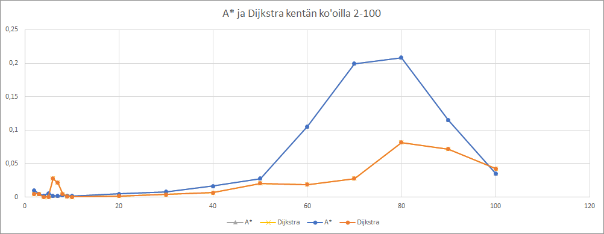
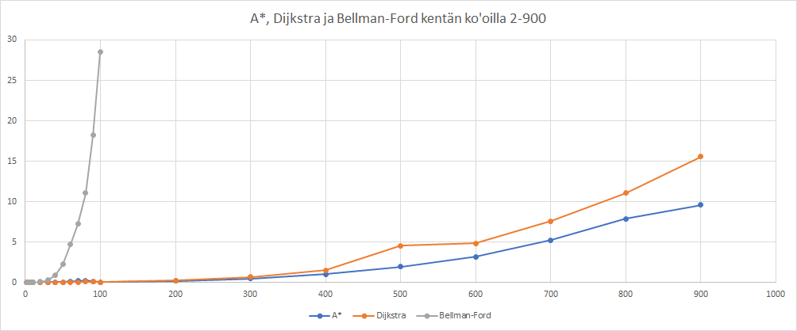

# Testausdokumentti
Dokumentin vanhat versiot löytyvät [täälä](Testaustilanne.md)

Sovellus on testattu kattavasti yksikkö- ja mutaatiotestauksilla. Testausraportti löytyy täälä: [Pitest](https://htmlpreview.github.io/?https://github.com/lauripaatelainen/Shortest-Path-Challenge/blob/master/Dokumentaatio/pitest/201810052224/index.html)

Sovelluksen suorituskyvyn osalta on analysoitu reitinhakualgoritmeja.
Yksittäisten tietorakenteiden (dynaaminen lista, linkitetty lista, joukko, hajautustaulu, minimikeko) tarkempi analysointi ei ollut mielekästä,
koska käytännössä operaatiot suoriutuivat niin nopeasti myös suurilla tietorakenteilla että Java kaatui OutOfMemoryErroriin ennen kuin tuloksia olisi voinut vertailla.

## Algoritmien suorituskyky.
Algoritmien suorituskyky on testattu automatisoidulla mittauksella, jonka voi suorittaa muuttamalla `build.gradle`-tiedostoon parametrin `ext.mainClass = 'com.edii.spc.perf.PerformanceTest'`.

Alla yhden suorituskykymittauksen tuloste.Suorituskykymittauksessa suoritetaan jokainen algoritmi siten että ensin pelikentän koko on väliltä 2-10, ja kokoa kasvatetaan yhdellä testien välissä.
Seuraavaksi testataan pelikentän koot välillä 10-100, ja kokoa kasvatetaan kymmenellä testien välissä.
Seuraavaksi testataan pelikentän koot välillä 100-1000, ja kokoa kasvatetaan sadalla testien välissä.
Yli 1000 kokoisilla pelikentillä pelkästään pelikentän muodostaminen kestää niin pitkään, ettei testejä ollut järkevää suorittaa. 
Yhdelle testitapaukselle on asetettu 5min aikaraja.

## Suorituskykymittauksen tuloste
Näytetään testin 'Ratkaistaan pelikenttä algoritmilla AStarSolver, pelikentän ko'oilla 2-10, askeleen koko 1' tulokset.

Kentän koko         | Solmujen määrä      | Kesto               | Keston kerroin      
------------------- | ------------------- | ------------------- | ------------------- 
2                   | 4                   | 0.01031             | n/a
3                   | 9                   | 0.00481             | 0.46684
4                   | 16                  | 0.00213             | 0.44159
5                   | 25                  | 0.00570             | 2.68427
6                   | 36                  | 0.00193             | 0.33815
7                   | 49                  | 0.00176             | 0.91414
8                   | 64                  | 0.00246             | 1.39275
9                   | 81                  | 0.00198             | 0.80664

Näytetään testin 'Ratkaistaan pelikenttä algoritmilla DijkstraSolver, pelikentän ko'oilla 2-10, askeleen koko 1' tulokset.

Kentän koko         | Solmujen määrä      | Kesto               | Keston kerroin      
------------------- | ------------------- | ------------------- | ------------------- 
2                   | 4                   | 0.00497             | n/a
3                   | 9                   | 0.00498             | 1.00201
4                   | 16                  | 0.00033             | 0.06582
5                   | 25                  | 0.00049             | 1.50292
6                   | 36                  | 0.02790             | 56.60598
7                   | 49                  | 0.02158             | 0.77346
8                   | 64                  | 0.00470             | 0.21784
9                   | 81                  | 0.00085             | 0.18034

Näytetään testin 'Ratkaistaan pelikenttä algoritmilla BellmanFordSolver, pelikentän ko'oilla 2-10, askeleen koko 1' tulokset.

Kentän koko         | Solmujen määrä      | Kesto               | Keston kerroin      
------------------- | ------------------- | ------------------- | ------------------- 
2                   | 4                   | 0.00026             | n/a
3                   | 9                   | 0.00023             | 0.88259
4                   | 16                  | 0.00041             | 1.74806
5                   | 25                  | 0.00048             | 1.17481
6                   | 36                  | 0.00088             | 1.83699
7                   | 49                  | 0.00149             | 1.70641
8                   | 64                  | 0.00230             | 1.53963
9                   | 81                  | 0.00384             | 1.67034

Näytetään testin 'Ratkaistaan pelikenttä algoritmilla AStarSolver, pelikentän ko'oilla 10-100, askeleen koko 10' tulokset.

Kentän koko         | Solmujen määrä      | Kesto               | Keston kerroin      
------------------- | ------------------- | ------------------- | ------------------- 
10                  | 100                 | 0.00174             | n/a
20                  | 400                 | 0.00490             | 2.81276
30                  | 900                 | 0.00793             | 1.61699
40                  | 1600                | 0.01653             | 2.08493
50                  | 2500                | 0.02772             | 1.67689
60                  | 3600                | 0.10529             | 3.79771
70                  | 4900                | 0.19933             | 1.89322
80                  | 6400                | 0.20837             | 1.04534
90                  | 8100                | 0.11476             | 0.55076

Näytetään testin 'Ratkaistaan pelikenttä algoritmilla DijkstraSolver, pelikentän ko'oilla 10-100, askeleen koko 10' tulokset.

Kentän koko         | Solmujen määrä      | Kesto               | Keston kerroin      
------------------- | ------------------- | ------------------- | ------------------- 
10                  | 100                 | 0.00040             | n/a
20                  | 400                 | 0.00148             | 3.66286
30                  | 900                 | 0.00402             | 2.72012
40                  | 1600                | 0.00667             | 1.65686
50                  | 2500                | 0.02035             | 3.05381
60                  | 3600                | 0.01850             | 0.90896
70                  | 4900                | 0.02786             | 1.50565
80                  | 6400                | 0.08182             | 2.93730
90                  | 8100                | 0.07181             | 0.87757

Näytetään testin 'Ratkaistaan pelikenttä algoritmilla BellmanFordSolver, pelikentän ko'oilla 10-100, askeleen koko 10' tulokset.

Kentän koko         | Solmujen määrä      | Kesto               | Keston kerroin      
------------------- | ------------------- | ------------------- | ------------------- 
10                  | 100                 | 0.00343             | n/a
20                  | 400                 | 0.07581             | 22.13070
30                  | 900                 | 0.26278             | 3.46627
40                  | 1600                | 0.93725             | 3.56663
50                  | 2500                | 2.22413             | 2.37303
60                  | 3600                | 4.74379             | 2.13287
70                  | 4900                | 7.22484             | 1.52301
80                  | 6400                | 11.03351            | 1.52716
90                  | 8100                | 18.21120            | 1.65054

Näytetään testin 'Ratkaistaan pelikenttä algoritmilla AStarSolver, pelikentän ko'oilla 100-1000, askeleen koko 100' tulokset.

Kentän koko         | Solmujen määrä      | Kesto               | Keston kerroin      
------------------- | ------------------- | ------------------- | ------------------- 
100                 | 10000               | 0.03542             | n/a
200                 | 40000               | 0.18331             | 5.17551
300                 | 90000               | 0.48335             | 2.63675
400                 | 160000              | 1.02150             | 2.11338
500                 | 250000              | 1.92443             | 1.88392
600                 | 360000              | 3.17009             | 1.64728
700                 | 490000              | 5.22857             | 1.64935
800                 | 640000              | 7.86799             | 1.50481
900                 | 810000              | 9.59223             | 1.21915

Näytetään testin 'Ratkaistaan pelikenttä algoritmilla DijkstraSolver, pelikentän ko'oilla 100-1000, askeleen koko 100' tulokset.

Kentän koko         | Solmujen määrä      | Kesto               | Keston kerroin      
------------------- | ------------------- | ------------------- | ------------------- 
100                 | 10000               | 0.04235             | n/a
200                 | 40000               | 0.24344             | 5.74789
300                 | 90000               | 0.66336             | 2.72500
400                 | 160000              | 1.51769             | 2.28788
500                 | 250000              | 4.54363             | 2.99378
600                 | 360000              | 4.81826             | 1.06044
700                 | 490000              | 7.58744             | 1.57472
800                 | 640000              | 11.07111            | 1.45914
900                 | 810000              | 15.56847            | 1.40622

Näytetään testin 'Ratkaistaan pelikenttä algoritmilla BellmanFordSolver, pelikentän ko'oilla 100-1000, askeleen koko 100' tulokset.

Kentän koko         | Solmujen määrä      | Kesto               | Keston kerroin      
------------------- | ------------------- | ------------------- | ------------------- 
100                 | 10000               | 28.50078            | n/a
200                 | 40000               | timeout             | n/a
300                 | 90000               | timeout             | n/a
400                 | 160000              | timeout             | n/a
500                 | 250000              | timeout             | n/a
600                 | 360000              | timeout             | n/a
700                 | 490000              | timeout             | n/a
800                 | 640000              | timeout             | n/a
900                 | 810000              | timeout             | n/a

## Suorituskykymittauksen graafinen esitys

## Suorituskykymittauksen analysointi
Tuloksista nähdään että Dijkstra ja A* ovat tässä käyttötapauksessa ylivoimaisia Bellman-Ford -algoritmiin verrattuna. Tämä oli toki myös odotettavissa aikavaativuuksista päätellessä. 
Bellman-Ford algoritmilla 100-kokoisen kentän ratkaisu päätyi 5min kohdalla toimeouttiin, vaikka Dijkstra ja A* selviytyivät tehtävästä kymmenissä millisekunneissa. 

Dijkstra on hieman A*-algoritmia nopeampi pienissä pelikentän ko'oissa, mutta erittäin suurissa pelikentissä A* muuttuu nopeammaksi. Täällä ei kuitenkaan tämän pelin kannalta
ole mitään hyötyä, koska niin suurilla pelikentillä normaali ihminen juurikaan pysty pelaamaan. Joten jos tästä pelistä joku joskus tekee kunnollisen version, kannattaa
lyhimmän polun etsimiseen käyttää Dijkstran algoritmia (tai jotain, joka ei ollut tämän projektin scopessa). 
